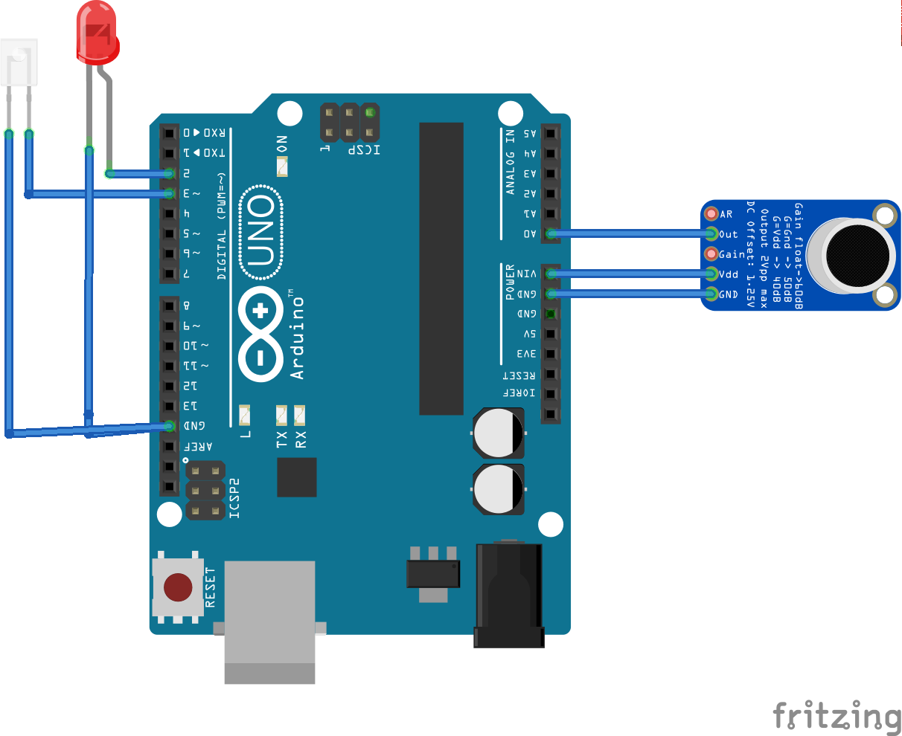

# Clap lamp project
This project is about a device able to switch ON and OFF a light just by clapping twice.
This can be used with almost any lamp that is controlled by a IR remote control, as long as:
* You know the IR commands for ON and OFF.
* You know which IR protocol is used, and this protocol is supported by the Arduino-IRremote library.

A clap is detected if the following conditions are met:
The trigger for a lamp state switch (double clap) is considered to be detected if the following conditions are met:
1. A first clap is detected after a period of more than 1 second without detecting any clap.
2. A second clap is detected in a period of [80-400] milliseconds after the first clap.
3. No third clap is detected in a period of [80-800] milliseconds after the second clap.

# The hardware
For this project you will need at least:
* Arduino Uno (or similar microcontroller. See below).
* IR emitter.
* Microphone. I have tested it with MAX4466 and MAX9814.
* Power supply.

Those components are enough for a functional implementation. To make it good looking, I added the following:
* Led (to give feedback about the clap detection).
* Arduino Uno prototyping shield (to solder all the components together).

# The software
## Installation
Getting the software up and running is as easy as cloning this repository (don't forget to include submodules for the Arduino-IRremote library) and flashing it to your Arduino.
I have developed it using an Arduino Uno, but I have always used the abstracted Arduino IDE API, so it should work with another Arduinos as well.
This can also be adapted to ESP12 by indicating the GPIO pin for the IR Emitter. An example can be found in: https://github.com/rbaltasar/home_automation/tree/master/bedroom_node
For the moment the Arduino-IRremote library does not support ESP32.

## Clap detection tuning
Once the hardware is ready and the software flashed, you should be able to clap twice and see the red LED blinking.
If this is not happening, there are many things that may have gone wrong. Here we will focus on tuning the clap detection.
First of all consider the conditions mentioned above. If you clap too fast or too slow, it will not work.
If you believe that you are clapping well but still not working, try tune the following parameters in config.h:
* SOUND_THRESHOLD: minimum value of the maximum amplitude (in time) within a group of samples. The lower the value, the more sensitive the device is.
* MAX_FREQ & MIN_FREQ: frequency spectrum where a clap may be. The larger the range, the more sensitive the device is, but also the less noise it filters.

The best way to tune it is by switching on the debug traces and to look at the output with and without claps, and adapt the configuration parameters to your claps, microphone, ambient noise...

If you see the led blinking when you clap twice, you are good to go to the next step.

## IR tuning
Most of the cheap LED lights use the same protocol (NEC) and commands to switch it on and off. If you are lucky, you have nothing to do here.
If not, the best way to figure out what protocol and commands you lamp respond to, is the following (you need additional hardware):
1. Upload the IR sniffer sketch to an Arduino.
2. Connect an IR receiver to your Arduino.
3. Sniff the commands from your IR remote. Update the my code with the right commands and protocol.

# The case
One it is functionally working, you will realize the whole thing is quite ugly to just let it stay like that.
Therefore I designed a basic case that can be 3D printed and that will hide all this ugliness. 
